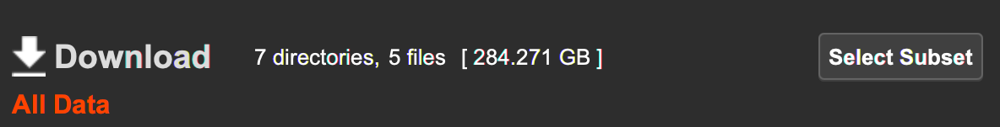
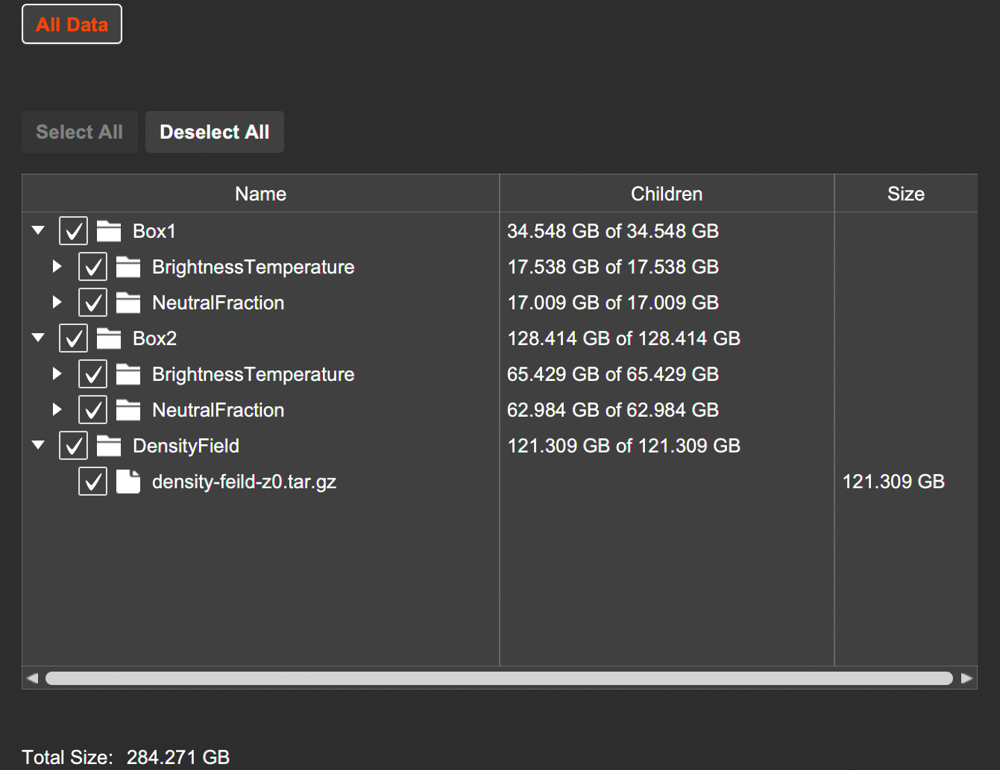

# Overview

This page provides instructions for downloading the various data products generated as part of the large-volume reionisation simulations of [Greig et al. (2022)](https://ui.adsabs.harvard.edu/abs/2022arXiv220509960G/abstract).

On this page you can find the following:

- [Simulation Details](#simulation-details)
- [Data Format](#data-format)
- [Download Instructions](#download-instructions)

## Simulation Details

These are light-cone simulations (line-of-sight signal varies with redshift) spanning different redshift (frequencies). The transverse scale of these simulations is 7.5 Gpc on a side and contain 6400 voxels.

The simulations assume: (1) linear structure formation, (2) saturated IGM spin temperature (TS >> TCMB) and (3) no redshift-space distortions (to be added at a later date).

#### Available data includes:
- z = 0 linear density field (800 2D slices corresponding to a depth of ~940 comoving Mpc)
- IGM neutral fraction field spanning 6.2 < z < 7.6 (420 2D slices) and 7.5 < z < 10.2 (600 2D slices)
- 21-cm brightness temperature field spanning 6.2 < z < 7.6 (420 2D slices) and 7.5 < z < 10.2 (600 2D slices)

** NOTE: ** Other data products can be added on reasonable request.

## Data Format

The various data products are available as `tar.gz` files. Once unzipped, the data is stored as individual 2D slices along the line-of-sight. These are stored as binary files, in C major format (x + DIM * y).

The filenames of these individual 2D slices contain all relevant meta information (redshift and corresponding slice number along the line-of-sight).

## Download Instructions

The data is stored using [Mediaflux](https://www.arcitecta.com/mediaflux/features/) and available through the Mediaflux Data Mover client. Clicking on the download link will first prompt you to download the Mediaflux Data Mover client before automatically opening it.

[Download :octicons-download-16:](https://mediaflux.researchsoftware.unimelb.edu.au/mflux/data/mover/index.html?token=2vilhfdlrb4whllhzkczxmaid273qez0eyj3c76jndkczuq17ya3iso6uuy8488gqiplvrfyyl1sqqzw5lbk5yd28lel1e22g60w49dklvkpyjtfqztaxha2wbvseswmhh1z5mrz6zkkr331m1yvjg3hseknbh6qs97iosezyqdimozhsgt25261aa4ts84jajph9jdez1axqvjw0tf53pvzhj2m5iepwnaihip){ .md-button }

** Note:** the provided link contains all ~285 GB of data. To access the smaller sub-sets of data click the ``Select Subset`` button within the Mediaflux Data Mover client: 

This will open up a directory list to access the individual data sub-sets:

#### Downloading directly from the command line

It is also possible to use the Mediaflux Data Mover tool via the command line. This is useful when you don't have easy access to a windowing environment (e.g. when working on an HPC system or remote VM). [Instructions can be found here](https://wiki-rcs.unimelb.edu.au/display/RCS/Data+Mover+Command+Line+Interface).
